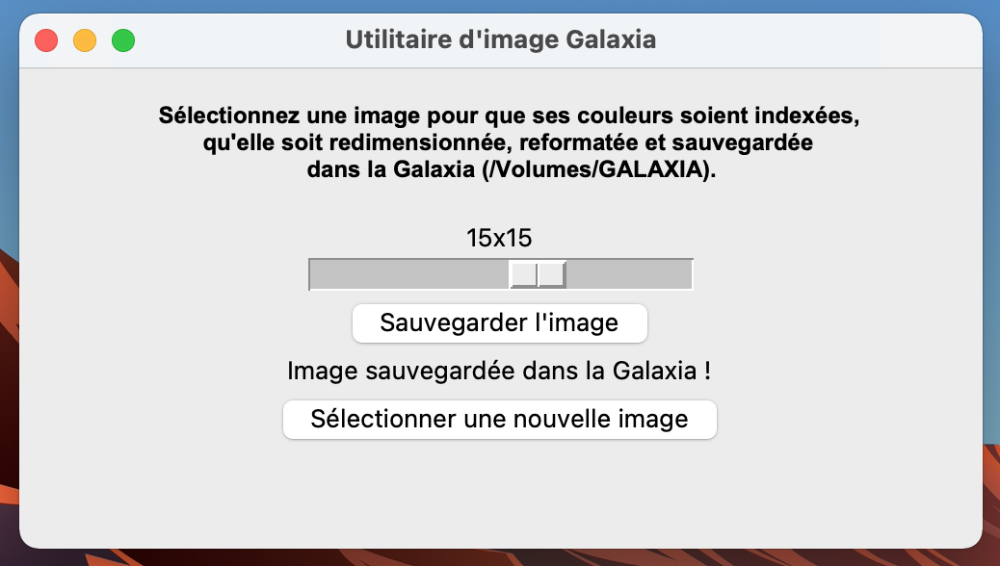

# Utilitaire d'image Galaxia

## 📖 Présentation
L'utilitaire d'image Galaxia permet de sélectionnez une image pour que ses couleurs soient indexées, qu'elle soit redimensionnée, reformatée et sauvegardée dans la Galaxia (/Volumes/GALAXIA).

[**Télécharger l'utilitaire d'image**](https://github.com/Emilien-B/sprites/releases)

</img>

## ⚙️ Utilisation
1. Cliquez sur "Sélctionner une image" et choissisez l'image 
2. Choissisez la taille d'image en utilisant le slider
3. Cliquez sur "Sauvegarder l'image"
4. Si l'image ne s'enregistre pas dans la Galaxia, choissiez un emplacement pour votre image